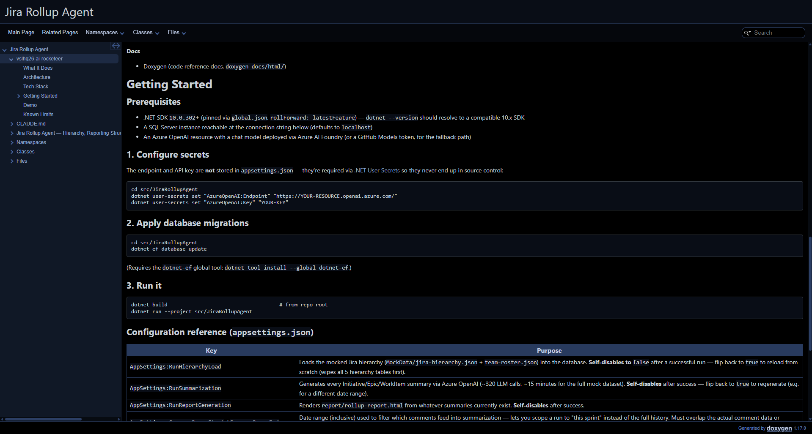
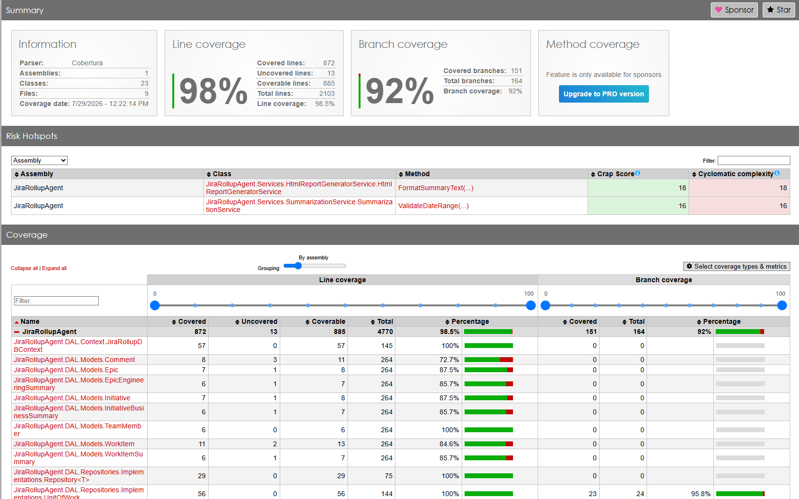
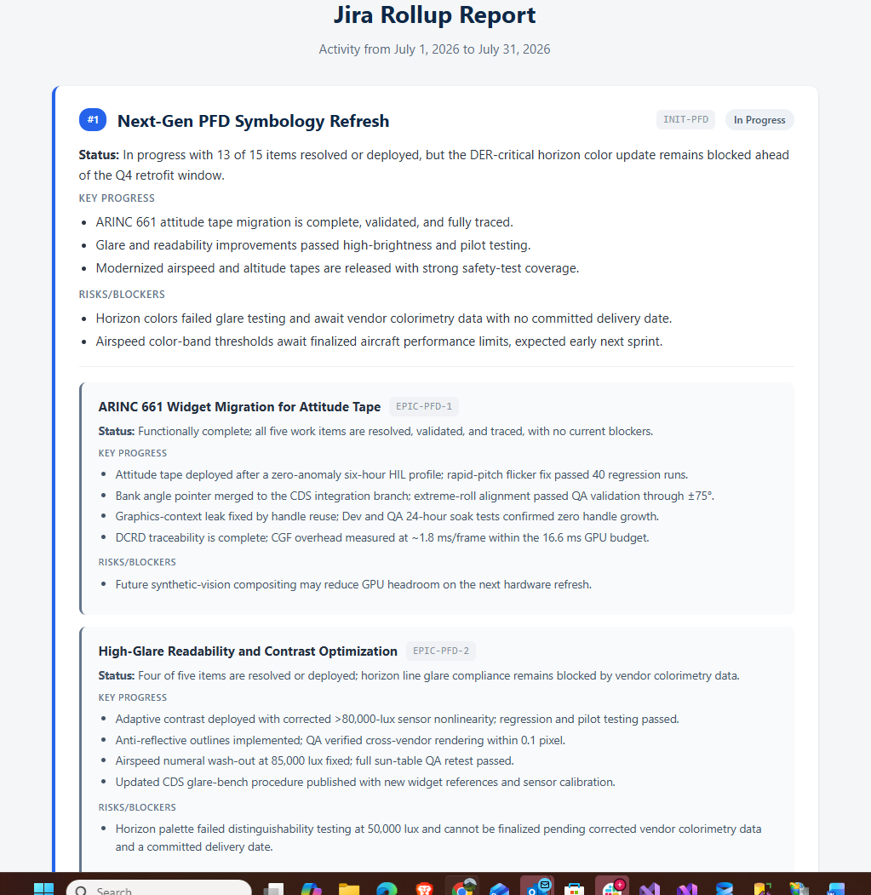
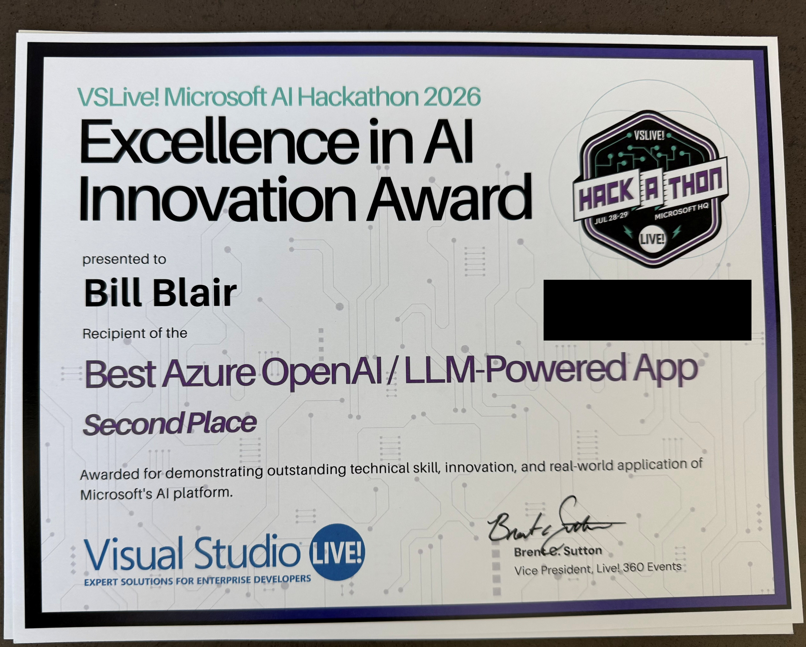

# vslhq26-ai-rocketeer

**Team:** Solo — [@bblair2018](https://github.com/bblair2018)

**Category:** Primary — Best AI Agent or Workflow Automation · Secondary — Best Azure OpenAI / LLM-Powered App

## What It Does

Jira Rollup Agent summarizes Jira activity across the full ticket hierarchy — Initiative → Epic → Story/Bug/Task/Spike (with Subtasks and StoryBugs under Stories). Comments (with author, timestamp, and role) are summarized at the item level and rolled up into a single HTML report: Initiatives are listed in order of business priority/rank, each showing a high-level **Business Summary** (weighted toward Scrum Master/Stakeholder/Engineering Manager commentary — status, risk, business impact), with each Initiative's Epics nested beneath it showing an **Engineering Summary** (weighted toward Dev/QA commentary: technical progress, blockers, bugs).

## Architecture

**Ticket Hierarchy:**

- Initiative
  - Epic
    - Story
      - Subtask
      - StoryBug
    - Bug (standalone, same level as Story)
    - Task
    - Spike

**Report Structure (single HTML report):**

- Initiatives, ordered by business priority/rank (from mock data)
  - Business Summary (per Initiative)
  - Epics (per Initiative)
    - Engineering Summary (per Epic)

**Data Flow:**

Mocked Jira Hierarchy (above, includes priority/rank field on Initiatives) → .NET Agent → Azure OpenAI → Item Summaries → Epic Engineering Summaries → Initiative Business Summaries → Sorted by Priority → Single HTML Report

1. **Input**: Mocked sample data representing the Jira hierarchy — Initiatives (with a priority/rank field) containing Epics, which contain Stories, Bugs, Tasks, and Spikes; Stories additionally contain Subtasks and StoryBugs. All items carry comments with author, timestamp, and author role (Dev/QA/Scrum Master/Stakeholder/Engineering Manager).
2. **Item summarization**: Single LLM summary per Story, Bug, Task, Spike (rolling up their Subtasks/StoryBugs where applicable)
3. **Epic summarization**: Comments across each Epic's items, filtered/weighted toward Dev/QA roles, summarized into an Engineering Summary
4. **Initiative summarization**: Comments across the Initiative, filtered/weighted toward Scrum Master/Stakeholder/Engineering Manager roles, summarized into a Business Summary
5. **Sorting**: Initiatives ordered by their priority/rank field
6. **Output**: A single HTML report — Initiatives listed by business priority, each with its Business Summary and nested Epic Engineering Summaries

*Note: mock data is used to simulate the existing Jira ingestion pipeline (already built separately) so the hackathon build can focus on summarization and reporting.*

## Tech Stack

**Runtime & Language**
- .NET 10, SDK `10.0.302` pinned via `global.json` (`rollForward: latestFeature`)
- C# 14 — the implicit default language version for a `net10.0` target; not explicitly pinned via `<LangVersion>` in the `.csproj`, so it'll track whatever the SDK defaults to on future upgrades

**AI**
- Azure OpenAI, deployed via Azure AI Foundry — model **`gpt-5.6-sol`**, set via `AppSettings:AzureOpenAI:ChatModel` in `appsettings.json` rather than hardcoded, so swapping deployments doesn't require a code change
- Accessed through `Microsoft.Extensions.AI` / `Microsoft.Extensions.AI.OpenAI` (the `IChatClient` abstraction) on top of `Azure.AI.OpenAI` — fallback: GitHub Models

**Data**
- Entity Framework Core 9 (`Microsoft.EntityFrameworkCore`, `.SqlServer`, `.Design`) against SQL Server (`VSLiveJiraRollup`)
- Mocked Jira hierarchy data (JSON) standing in for the existing ingestion pipeline

**App Framework & Logging**
- `Microsoft.Extensions.Hosting` (generic host, DI, configuration)
- Serilog (`Extensions.Hosting`, `Settings.Configuration`, `Sinks.Console`, `Sinks.File`, `Enrichers.Context`) — console + rolling file logs

**Testing & Code Coverage**
- xUnit + FluentAssertions + Moq
- EF Core Sqlite (in-memory) for DAL-layer tests, since mocking `IUnitOfWork` can't exercise the repository/`DbContext` code itself
- coverlet + ReportGenerator for coverage reporting (98.5% line coverage across 91 tests)

**Docs**
- Doxygen (code reference docs, `doxygen-docs/html/`)

## Getting Started

### Prerequisites
- .NET SDK `10.0.302`+ (pinned via `global.json`, `rollForward: latestFeature`) — `dotnet --version` should resolve to a compatible 10.x SDK
- A SQL Server instance reachable at the connection string below (defaults to `localhost`)
- An Azure OpenAI resource with a chat model deployed via Azure AI Foundry (or a GitHub Models token, for the fallback path)

### 1. Configure secrets
The endpoint and API key are **not** stored in `appsettings.json` — they're required via [.NET User Secrets](https://learn.microsoft.com/aspnet/core/security/app-secrets) so they never end up in source control:

```
cd src/JiraRollupAgent
dotnet user-secrets set "AzureOpenAI:Endpoint" "https://YOUR-RESOURCE.openai.azure.com/"
dotnet user-secrets set "AzureOpenAI:Key" "YOUR-KEY"
```

### 2. Apply database migrations
```
cd src/JiraRollupAgent
dotnet ef database update
```
(Requires the `dotnet-ef` global tool: `dotnet tool install --global dotnet-ef`.)

### 3. Run it
```
dotnet build                                     # from repo root
dotnet run --project src/JiraRollupAgent
```

### Configuration reference (`appsettings.json`)

| Key | Purpose |
|---|---|
| `AppSettings:RunHierarchyLoad` | Loads the mocked Jira hierarchy (`MockData/jira-hierarchy.json` + `team-roster.json`) into the database. **Self-disables to `false`** after a successful run — flip back to `true` to reload from scratch (wipes all 5 hierarchy tables first). |
| `AppSettings:RunSummarization` | Generates every Initiative/Epic/WorkItem summary via Azure OpenAI (~320 LLM calls, ~15 minutes for the full mock dataset). **Self-disables** after success — flip back to `true` to regenerate (e.g. for a different date range). |
| `AppSettings:RunReportGeneration` | Renders `report/rollup-report.html` from whatever summaries currently exist. **Self-disables** after success. |
| `AppSettings:SummaryRangeStart` / `SummaryRangeEnd` | Date range (inclusive) used to filter which comments feed into summarization — lets you scope a run to "this sprint" instead of the full history. Must overlap the actual comment data or `RunSummarization` fails fast with a clear error. |
| `ConnectionStrings:VSLiveJiraRollupConnectionString` | SQL Server connection string for the `VSLiveJiraRollup` database. |
| `AzureOpenAI:ChatModel` | The deployed model name to call (e.g. `gpt-5.6-sol`) — not a secret, just an identifier, so it lives here rather than in user secrets. |
| `Serilog:*` | Console log level and output template; a rolling daily file sink is also configured (in code, not here) at `Logs/JiraRollupAgent.log` relative to the build output. |

All three `AppSettings:Run*` flags are meant to run once each. Because `appsettings.json` has `CopyToOutputDirectory: Always`, **every** `dotnet run` re-copies it from source over the build output before the app starts — so a flag only "stays off" between runs if it's also set to `false` in the checked-in source file, not just flipped by the app at runtime.

### Running tests
```
dotnet test test/JiraRollupAgent.Tests
```

### Generated docs & reports

Two static HTML sites are already generated and checked into the repo — open them directly in a browser, no server needed.

Full C# API reference (classes, methods, call graphs) for both `src/JiraRollupAgent` and `test/JiraRollupAgent.Tests`, generated by Doxygen:
```
doxygen-docs/html/index.html
```
<p align="center"></p>

Unit test code coverage report (line/branch/method %, drill-down per file), generated by coverlet + ReportGenerator:
```
code-coverage-reports/index.html
```
<p align="center"></p>

Both are regenerated on demand (see `doxygen Doxyfile` under "Commands" above, and the coverage commands above) — they aren't rebuilt automatically, so re-run them after making changes if you want the browsable docs to reflect the latest code.

### Sample rollup report

This is the actual output of the app itself — not a dev tool like the two above, but the single HTML report the whole pipeline exists to produce: Initiatives ordered by business priority, each with its Business Summary, and its Epics nested underneath with their Engineering Summaries.

```
report/rollup-report.html
```
<p align="center"></p>

## Demo

📹 `./demo/JiraRollupAgent.mp4`

## Known Limits

- Uses mocked Jira data rather than a live pull for the demo; real ingestion pipeline exists separately and can be substituted
- Item-level summaries (Story/Bug/Task/Spike) do not have a role split — role weighting only applies at Epic (Engineering) and Initiative (Business) level
- Initiative ranking relies on a priority/rank field present in the mock data — no independent prioritization logic
- Summary quality depends on comment volume and consistency of the mocked/real role data

## Award

**Second Place — Best Azure OpenAI / LLM-Powered App**, VSLive! Microsoft AI Hackathon 2026 (Microsoft HQ, July 28–29).

> "Awarded for demonstrating outstanding technical skill, innovation, and real-world application of Microsoft's AI platform."

<p align="center"></p>
